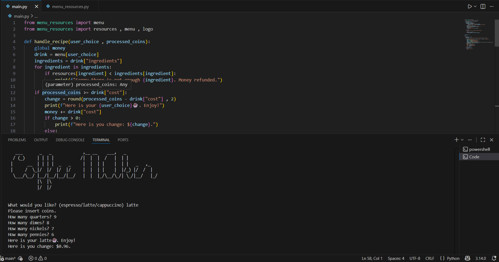

# ☕ Coffee Machine Simulator (Python)

This is a simple Python-based command-line coffee machine simulator. It allows users to purchase drinks like espresso, latte, and cappuccino by inserting virtual coins.   
The machine checks for sufficient resources and handles change and reporting.

---

## Demo



---

## 📜 Features

* Choose from: espresso, latte, or cappuccino
* Insert coins in quarters, dimes, nickels, and pennies
* Calculates total money inserted and returns change if needed
* Checks if enough ingredients are available
* "report" command to display current resources and money
* "off" command to turn off the machine
* Clear, user-friendly terminal prompts and error messages.
  
---

## Installation

1. Clone the repo:
```bash
git clone https://github.com/HarshCh16/Coffee-Machine.git
```
2. Open the folder Coffee Machine
```bash
cd Coffee-Machine
```
The project is pure Python with no external packages, no installs are necessary.


---

## Usage

Run the main program:
```bash
python main.py
```
Typical interaction:    
Choose a drink by entering its number/name.     
Insert coins or a total amount when prompted.   
The machine either:   
Prepares your drink and prints a success message, or    
Prints why it cannot prepare the drink (insufficient resources, insufficient money).       
Use administrative commands (e.g., report, off) as implemented to inspect and manage the machine.   

---

## Implementation approach

This project takes a simple, modular approach:

1. Data model
   * Store the machine state (water, milk, coffee, cups, money) in a single structure (dictionary or class).
   * Store menu/recipes in a separate dictionary mapping drink names → required resources + cost.
2. Input / Output layer
  * A loop that presents options and reads user commands (purchase, report, refill, exit).
  * Input validation to handle wrong inputs gracefully.
3. Business logic
  * Check resources before processing payment.
  * Process coins / money, compute change, and update money pool.
  * Deduct resources on successful sale; do not change state on failed transaction.
4. Utility functions
  * check_resources(drink), process_payment(cost), make_drink(drink), print_report() for separation of concerns and easier testing.
  * This structure keeps code readable and makes it simple to add features later (new drinks, different currencies, GUI, etc.).

---

## Key learnings

How to model application state and keep it consistent across operations.

Simple input validation and user-friendly CLI design.

Separating responsibilities (I/O vs business logic) to make code maintainable and testable.

Basic arithmetic for handling payments and giving change.

Designing data-driven features (recipes defined in data, not hard-coded logic).
